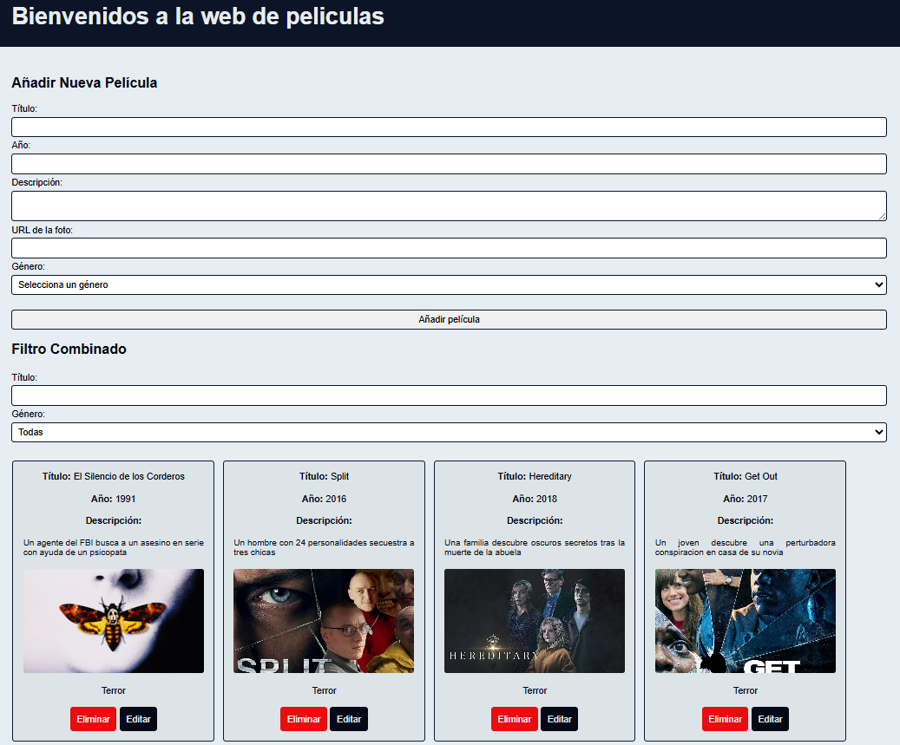

# 🎬 Movies Website

Proyecto web desarrollado con **HTML, CSS y JavaScript** para gestionar un catálogo de películas. Permite añadir, editar, eliminar y filtrar películas por título y género, con diseño totalmente responsive.

---

## 📸 Vista previa



---

## 🚀 Características

- 🎥 Catálogo de películas con tarjetas visuales (imagen, título, año, descripción y género)
- ➕ Añadir películas mediante un formulario con validaciones
- ✏️ Editar películas directamente desde la tarjeta
- 🗑️ Eliminar películas con un solo clic
- 🔍 Filtro combinado por título y por género (Terror, Acción, Comedia, Romance)
- 📱 Diseño responsive adaptado a móvil, tablet y escritorio

---

## 🛠️ Tecnologías utilizadas

| Tecnología         | Uso                                         |
|--------------------|---------------------------------------------|
| HTML5              | Estructura de la página                     |
| CSS3               | Estilos y diseño responsive (media queries) |
| JavaScript Vanilla | Lógica, DOM, eventos y validaciones         |

---

## 📁 Estructura del proyecto

```
movies-website/
├── index.html          # Estructura principal de la página
├── script.js           # Lógica JavaScript (CRUD + filtros)
└── styles/
    ├── normalize.css   # Reset de estilos del navegador
    └── style.css       # Estilos personalizados + responsive
```

---

## ⚙️ Cómo usarlo

### 1. Clonar el repositorio

```bash
git clone https://github.com/tuusuario/movies-website.git
```

### 2. Entrar en la carpeta

```bash
cd movies-website
```

### 3. Abrir en el navegador

Abre el archivo `index.html` directamente en tu navegador. No necesita servidor ni instalación de dependencias.

---

## 📋 Funcionalidades en detalle

### Añadir película

Rellena el formulario con título, año, descripción, URL de la imagen y género. El formulario incluye validaciones:

- El título debe tener entre 3 y 20 caracteres (solo letras y espacios)
- El año debe estar entre 1800 y el año actual
- La descripción admite hasta 100 caracteres
- La URL debe comenzar por `http://` o `https://`

### Editar película

Haz clic en el botón **Editar** de cualquier tarjeta para modificar sus datos. Confirma con **Guardar**.

### Eliminar película

Haz clic en el botón **Eliminar** de cualquier tarjeta para borrarla del catálogo.

### Filtrar películas

Usa el buscador de título para filtrar en tiempo real, o selecciona un género en el desplegable. Ambos filtros funcionan a la vez.

---

## 📱 Responsive design

| Pantalla                   | Comportamiento      |
|----------------------------|---------------------|
| < 588px (móvil)            | 1 tarjeta por fila  |
| 588px - 800px (tablet)     | 2 tarjetas por fila |
| 800px - 1100px (ordenador) | 3 tarjetas por fila |
| > 1100px (pantalla grande) | 4 tarjetas por fila |

---

## 🤝 Contribuir

¡Las contribuciones son bienvenidas! Si quieres mejorar el proyecto:

1. Haz un **fork** del repositorio
2. Crea una rama nueva:
```bash
git checkout -b mejora/nueva-funcionalidad
```
3. Haz tus cambios y commitea:
```bash
git commit -m "Añade nueva funcionalidad"
```
4. Sube la rama:
```bash
git push origin mejora/nueva-funcionalidad
```
5. Abre un **Pull Request**

---

## 📄 Licencia

Este proyecto es de uso libre para fines educativos.

---